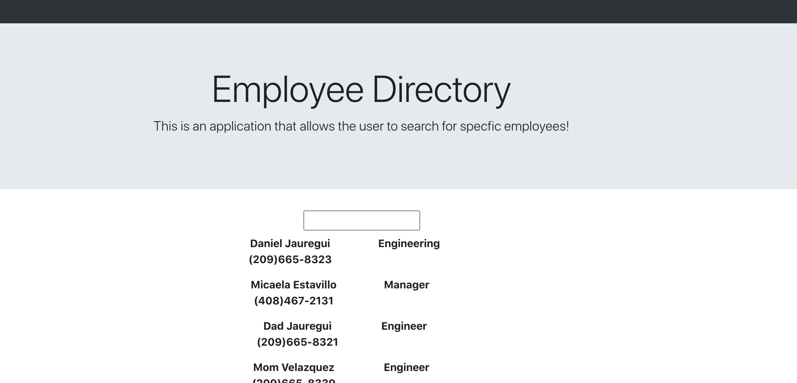

# Employee Directory
This application utitlizes the state mangement of various conditions based on the user input. Here we have a mock employee workplace that has a set of employees that are at the workplace. For management purposes a user wants to iterate and just find an employee's basic information. This is made for the conviniency of management and employee communication and ease of access. 

# Site Picture

# Usage 

If using this repository, this requires the user to delete the package-lock.json file and run this command in terminal 
``
npm install
``
This allows the user to reinstall the dependencies from their local machine.
## Technologies
* HTML
* CSS
* React.js
* Bootstrap

#Deployed Site
* [Link to deployed site](https://kionling.github.io/empDirectory/)
* [Link to repo](https://github.com/Kionling/empDirectory)
#Authors
* [Daniel Jauregui](https://github.com/Kionling)

